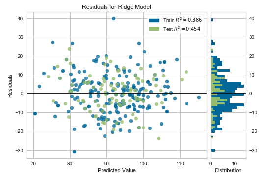
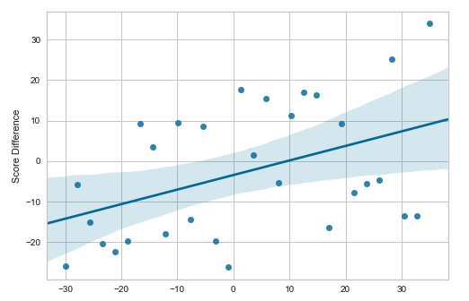
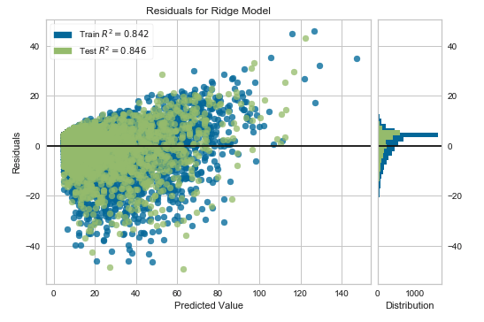
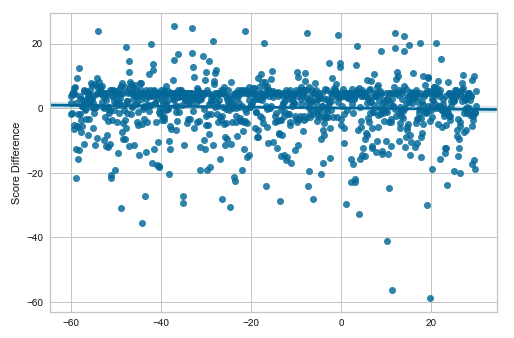
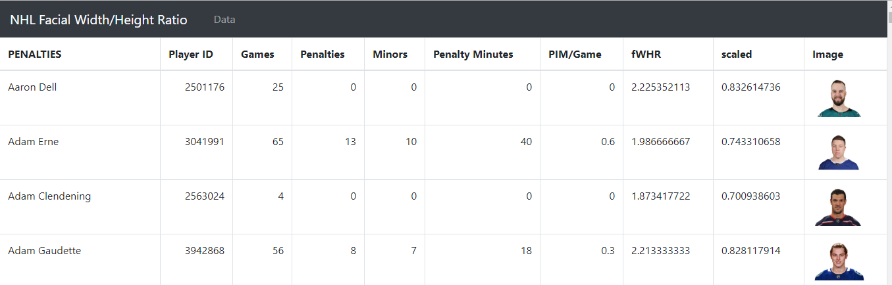
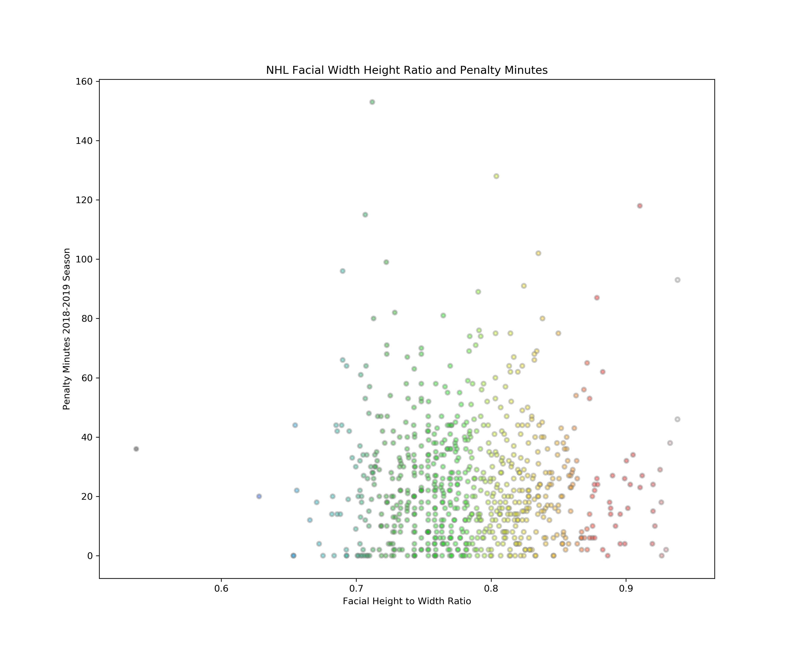

# Machine Learning - Hockey Points Predictions

Machine learning is one of the intelligent methodologies that have shown promising results in the domains of classification and prediction. Sports prediction, in particular, is an expanding areas that necessitates good predictive accuracy.  Additionally, club managers, owners and coaches are desirous of classification models that will enable them to understand and formulate strategies needed to win games. These models are based on numerous factors involved in the games, such as the results of historical matches, player performance indicators, and opposition information. Statistics for this analysis were obtained from [Hockey Statistics](https://www.hockey-reference.com/).

## Project Purpose

**To use predictive analytics and 10 years of historical team and skater hockey statistics to predict points scored by teams and skaters over a season, thereby enabling the user to extrapolate who will make it to the playoffs.  In addition, to use facial recognition ML to determine the facial width to height ratio of NHL players to determine whether a higher fwhr leads to more penalty minutes.**

## Objectives:

* Determine which ML model(s) best fit(s) the data and purpose using Random Forest, Support Vector Machine, Neural Networks and Linear Regression analysis.

* Determine which features are most accurate while also being unique and non-intuitive.

### __Team Stats Linear Regression Analysis__

* Using Strength of Schedule, Power Play Goals Against, Power Play Opportunities Against and Save Percent as features to train the model.

* Predicting 2006 team points using the linear regression model above.

### __Skater Stats Linear Regression Analysis__

* Using Even Strength Goals, Power Play Goals, and Short-handed goals as features to train the model.

* Predicting 2006 skater points using the linear regression model above.

### __Skater Facial Recognition Deep Learning__

* Using Facial Recognition Machine Learning to determine the facial width to height ratio (FWHR) of an imported hockey player image.

* Predict whether a higher FWHR leads to more penalty minutes.

